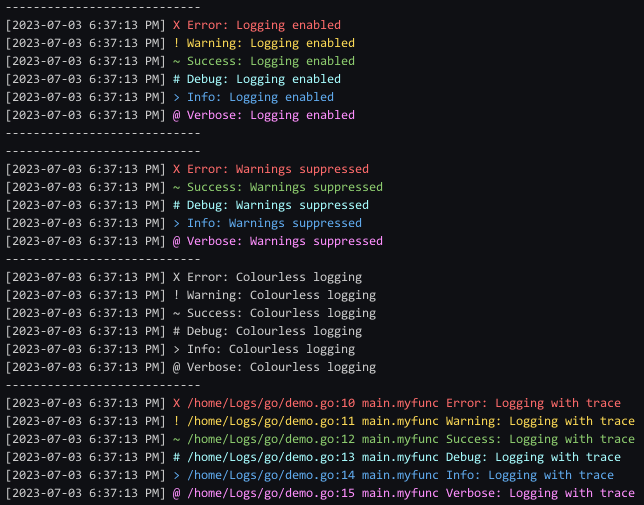

# Logging API

### Usage

Messages can be printed on any of the following log levels:

```go
log.LogError(message...)
log.LogWarning(message...)
log.LogSuccess(message...)
log.LogDebug(message...)
log.LogInfo(message...)
log.LogVerbose(message...)
```

Each log level has an associated enum:

```go
log.LogLevelError
log.LogLevelWarning
log.LogLevelSuccess
log.LogLevelDebug
log.LogLevelInfo
log.LogLevelVerbose
```

Each log level has a prefix symbol with a unique ANSI colour.  If your terminal does not support colours, you can disable it:

```go
// disable colour logging
log.Colourless()
// enable colour logging
log.Colourize()
```

Each log level can be individually suppressed:

```go
// suppress warning logs
log.LogLevelWarning.Suppress()
// show warning logs
log.LogLevelWarning.Show()
```

All log printing can be disabled.  This overrides suppressions.  When enabled, suppressions still apply:

```go
// enable logging
log.Enable()
// disable logging
log.Disable()
```

The file, line number, and calling function can be traced. By default, tracing is disabled and has to be manually enabled:

```go
// enable trace in logs
log.Traceful()
// disable trace in logs
log.Traceless()
```

### Example

The following example can be found in `demo.go`

#### Code

```go
package main

import (
	"fmt"

	"github.com/bricktrooper/Logs/go/log"
)

func myfunc(message string) {
	log.LogError("Error:", message)
	log.LogWarning("Warning:", message)
	log.LogSuccess("Success:", message)
	log.LogDebug("Debug:", message)
	log.LogInfo("Info:", message)
	log.LogVerbose("Verbose:", message)
}

func main() {
	fmt.Println("----------------------------")
	myfunc("Logging enabled")

	fmt.Println("----------------------------")
	log.Disable()
	myfunc("Logging disabled")

	fmt.Println("----------------------------")
	log.Enable()
	log.LogLevelWarning.Suppress()
	myfunc("Warnings suppressed")

	fmt.Println("----------------------------")
	log.LogLevelWarning.Show()
	log.Colourless()
	myfunc("Colourless logging")

	fmt.Println("----------------------------")
	log.Colourize()
	log.Traceful()
	myfunc("Logging with trace")
}

```

#### Output


